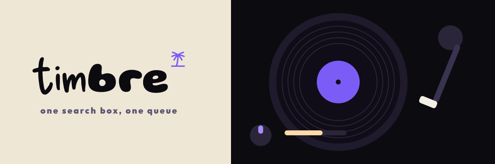

# Timbre brand kit

Everything the brand is made of, in one place: the mark, the wordmark, the banners, the palette,
and the record of how each was chosen. Before changing any of it, read [How we got here](#how-we-got-here) —
most of what looks arbitrary is a decision that was already argued out, and two of the numbers are
measured rather than judged.



## What is in here

```
docs/brand/
  logo/
    mark/       the palm alone            4 SVG + 25 PNG
    wordmark/   "timbre" alone            4 SVG + 16 PNG
    lockup/     wordmark + palm           5 SVG + 20 PNG
    avatar/     square tile, rounded      3 SVG + 18 PNG
    app-icon/   what the app itself ships (icon.svg, favicon.ico, 3 PWA rasters)
  banners/
    readme-banner.png   1200x400 — the current banner, the README, and the link card
    readme-banner.tsx   its source; the PNG is regenerated from this, byte for byte
    turntable-deck.png  the previous banner, superseded 2026-09-15
  type/         the two-face wordmark and its measured offsets
  history/      the specimen sheets the "tim" was chosen from
```

### Which file do I want

| I need | Take |
|---|---|
| the logo, on a dark background | `logo/lockup/timbre-lockup-on-dark.svg` |
| the logo, on a light background | `logo/lockup/timbre-lockup-on-light.svg` |
| the logo, exactly as the banner draws it | `logo/lockup/timbre-lockup-sunset.svg` |
| just the name | `logo/wordmark/timbre-wordmark-{on-dark,on-light,violet}.svg` |
| just the palm | `logo/mark/timbre-mark-{on-dark,on-light,violet}.svg` |
| a profile picture / org avatar | `logo/avatar/timbre-avatar-{violet,on-dark,on-light}.svg` |
| to inherit the surrounding colour | the un-suffixed `timbre-{mark,wordmark,lockup}.svg` — they fill with `currentColor` |
| a PNG | the `png/` folder beside each, named by **height**: `…-256.png` is 256px tall |

`on-dark` is the cream artwork **for use on** a dark background; `on-light` is the ink artwork for a
light one. Every SVG and PNG has a transparent background — the colour in the name is the ink.

### The SVGs carry no font

The wordmark is normally drawn by Satori from two `.woff` files, so it only ever existed inside a
rendered banner. `scripts/brand-assets.mts` converts the glyphs to **outlines**, which is why these
files open correctly in a browser, in Figma, and anywhere else without the faces installed.

That conversion is checked, not assumed. `node scripts/brand-assets.mts --verify` rebuilds the
wordmark at the banner's own size and position and compares it against the shipped banner pixel by
pixel: **92.65% IoU and zero disagreements more than 2px from a mask edge** — i.e. every difference
is antialiasing. Run it after touching any constant in that script.

### Regenerating

```
node scripts/brand-assets.mts            # mark, wordmark, lockup, avatar — SVG and PNG
node scripts/brand-assets.mts --verify   # check the outlines still match the banner
node scripts/brand-export.mts            # refresh logo/app-icon from what the app ships
node scripts/brand-export.mts --check    # fail if it has drifted
```

`brand-assets` parses the `.woff` files directly rather than pulling in a font library, because the
repo has no font dependency and adding one to the lockfile costs every other session an install.
All three faces are TrueType-flavoured (`glyf`, quadratic curves), which is the easy case; a CFF/OTF
face would need a real library. PNGs need `sharp`, which is not a dependency either — it is found in
the pnpm store if Next dragged it in, and skipped with a note if not. SVG is always written.

`logo/app-icon/` holds **copies**. The canonical files are `apps/web/app/icon.svg`,
`apps/web/app/favicon.ico` and `apps/web/public/icon-*.png`. `banners/readme-banner.{png,tsx}` are
canonical here — nothing else owns them.

## The mark

A palm tree, black, standing on a line. `viewBox="0 0 247 282"`, filled with `currentColor` so it
takes the colour of whatever it sits in — cream on the sea, `#ffd9a8` beside the wordmark, black on
violet in the app icon.

It heads the desktop rail with **no wordmark beside it**. The name is already the tab title and the
installed app name; a third copy would only cost the library panel below it a row of height. It is
not a link either — Home is a nav button a centimetre under it.

The maskable icon is full-bleed, not a circle on transparency. The old one relied on the launcher
cropping to a circle; a square-cropping launcher would have shown the transparent corners.

> **Provenance.** The palm is Poke.com's logomark, taken from their public brand kit. This is
> recorded here so nobody has to rediscover it. It was replaced once with an original mark and the
> replacement was reverted — see [How we got here](#how-we-got-here). Whether that is acceptable is
> the owner's call, and the call has been made; it is not re-litigated in commits.

## The wordmark

`tim` in Delicious Handrawn + `bre` in Gluten at 0.94×, with the palm set after it.
**Two faces on purpose.** The full spec, including the three measured offsets and the Satori
alignment trap, is in [`type/README.md`](type/README.md).

Three things draw it, and they must agree:

- `logo/wordmark/` and `logo/lockup/` — the outlined SVGs, generated by `scripts/brand-assets.mts`
- [`banners/readme-banner.tsx`](banners/readme-banner.tsx) — the README banner
- `apps/web/app/opengraph-image.tsx` — the link card

The last two are **the same picture at the same size**; if the wordmark or the palette changes in
one, change it in the other. The SVGs are then regenerated from the same constants, and `--verify`
is what proves all three still agree.

## Palette

| Token | Hex | Where |
|---|---|---|
| Violet (accent) | `#7C5CF6` | app accent, icon background |
| Sky, top | `#2a1a5c` | banner gradient 0% |
| Sky, middle | `#5b3fd6` | banner gradient 58% |
| Sky, bottom | `#8f74ff` | banner gradient 100% |
| Sun | `#ffd9a8` | the disc, and the palm beside the wordmark |
| Sea | `#1b1140` | below the horizon, and the standing palm |
| Sea line 1 | `#4a34a8` | ripples |
| Sea line 2 | `#3d2a90` | alternating ripples |
| Horizon edge | `#6247c9` @ 0.6 | the 2px line at y=278 |
| Cream | `#f3efe4` | the wordmark |
| Caption | `#e7dcff` | the strapline |

Every fill is **flat**. Satori does not resolve `url(#id)` gradient references, so gradients exist
only as the one CSS `linear-gradient` on the root div.

## Redrawing a banner

The source is kept so the next change is an edit rather than a redesign. The banner before it was a
PNG with no source, which is why replacing it took a day.

```
1. cp docs/brand/banners/readme-banner.tsx apps/web/app/banner-preview/route.tsx
2. cd apps/web && TIMBRE_DIST_DIR=.next-banner npx next dev -p 3249
3. curl -o ../../docs/brand/banners/readme-banner.png http://localhost:3249/banner-preview
4. rm -r apps/web/app/banner-preview apps/web/.next-banner apps/web/.next/dev/types
   then `npx next typegen` and `git checkout -- apps/web/tsconfig.json`
```

Step 4 is not tidying. Left in place, that route is a **public endpoint on the deployment**, and the
stale route validator Next leaves in `.next/dev/types` fails typecheck until it is regenerated.

Pick a free port and a `TIMBRE_DIST_DIR` nobody else is using — another session drawing the link
card runs the same dance, and two dev servers sharing a dist dir corrupt it.

Two Satori limits are load-bearing, both found the hard way: a component or fragment returning
`<svg>` children renders as **nothing**, and `url(#id)` references do not resolve. So every shape is
inline and every fill is flat.

### Check a render, not the diff

The font bug that produced a wrong-but-plausible banner is invisible in code review. After any
change, look at the PNG: the `bre` must be visibly heavier and rounder than the `tim`, and the
strapline must be Outfit, not handwriting.

---

## How we got here

### 2026-09-05 — the palm arrives

The owner pointed at a downloaded brand kit: *"can you put this as timbre's logo"*, then narrowed it
— *"no... not the poke.com... just the tree icon"*. The icon set was redrawn from that palm
logomark, black on the same violet the old note icon used, at the corner radius measured off the
file it replaced. `app/icon.svg` became the source the rasters come from.

The tab title was cut to two states in the same change: `Timbre`, or `Timbre · <song>` once
something is loaded — *"i dont want the tab text to be long"*.

### 2026-09-05 — the waveform, and the revert

The palm was Poke.com's. Fine while this was a private experiment, wrong the moment v0.3.0 was
tagged and deployed with *"a new mark"* as the headline changelog entry. It was replaced with an
original: three lobes of a rich waveform — two instruments playing the same note at the same volume
differ in the shape of the wave, and that shape is their timbre.

Rejected on the way: a spectrum-bar mark (legible, but a near-copy of the three-bar playing
indicator already in the player bar), and a prism (at icon size it reads unmistakably as a back
arrow).

**The owner put the palm back.** `revert(web): the palm returns to the tab icon`, byte-identical to
the mark it replaced.

### 2026-09-08 → 09-13 — the turntable, and a card that said Timbre three times

First branded banner and social card. The card was then cut down — it said *Timbre* three times over
(site name, title, artwork) and repeated the tagline in both the title and the image.

### 2026-09-13 → 09-14 — choosing the type

Roughly thirty candidates over many rounds, driven entirely by the owner's eye:

- *"i want you to fix the banner, i dont know why it became boring and weird now. cant you be more creative"*
- A [Blume brand identity](https://www.behance.net/gallery/184157661/Blume-Brand-Identity-and-Packaging) supplied as the reference — heavy rounded lowercase.
- *"for the 'bre' i like the gluten 800, for the 'tim' maybe try outfit 900"* — the `bre` was settled first and never moved again.
- *"i feel like none of the tim fonts are speaking to me, can you find other fonts"* → a wider sheet → *"i liek these. idk the name of them though. create a new img with the name of the fonts at the right"*, which is [`history/03-tim-specimen-named.png`](history/03-tim-specimen-named.png).
- *"can you make the bre smaller"* → 0.94×.
- Delicious Handrawn won the `tim`.

The turntable banner (`banners/turntable-deck.png`) was adopted here — *"just use gg as the official
banner for now"* — and carried the old strapline, "one search box, one queue".

### 2026-09-15 — the shore at dusk

The current banner. A violet sky, the sun going down behind a flat dark sea, and the mark standing
in it as the palm it already is — the logo is the picture, not a logo placed beside one. The sun
sits *behind* the palm so the two read as one silhouette.

The strapline changed with it, to the one that says what this is rather than what the search box is.

The link card followed, at 1200x400 rather than the conventional 1200x630: the banner shape **is**
the design, and reflowing it into a 630-tall frame opens up the sky, drops the lockup away from the
top edge, and shrinks the whole thing when it is scaled to fit. Unfurlers take the size as given.

Getting there turned up the font-tracing bug now documented in `apps/web/app/brand-fonts/README.md`.
The banner was verified the honest way: the regenerated PNG is **byte-identical** to the image that
was chosen, `md5 0fee4d9690a337c9ba589749d81f2825`. Not "looks right" — the same bytes.
